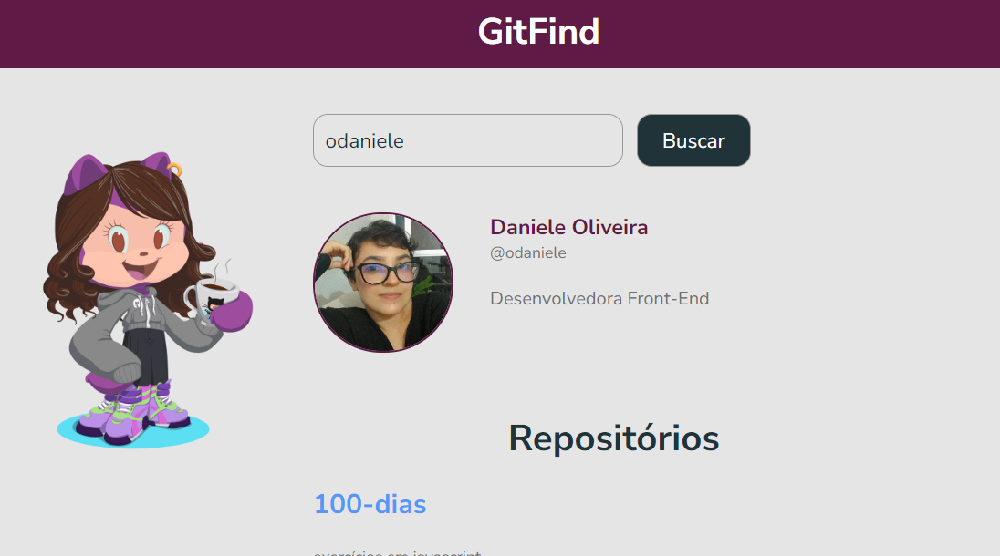

<h1 align="center">GitFind 🔎</h1> 

O **GitFind** é uma aplicação que utiliza a API do GitHub para buscar e exibir informações de perfis de usuários. Essa aplicação pode ser utilizada para visualizar detalhes como repositórios públicos e outros dados disponíveis no perfil do GitHub.



---

## **⚙️ Modo de Usar**

🕹️ **Busca por Usuário:**
   - Digite o nome de usuário do GitHub na barra de busca da aplicação.
   - Clique no botão de pesquisa "Buscar".
   - As informações do perfil serão exibidas na tela, incluindo:
     - Nome do usuário
     - Avatar
     - Biografia
     - Repositórios públicos

---

## ⚙️**Ferramentas de Desenvolvimento**

### 🪛 **Front-End**
- **React**: Para construir a interface do usuário de forma declarativa e reativa.
- **Axios**: Para realizar requisições HTTP à API do GitHub.
- **CSS/Styled-Components**: Para estilização da aplicação.


### 🪛 **API do GitHub**
- Endpoints utilizados:
  - **Buscar usuário**: `https://api.github.com/users/{username}`
  - **Repositórios do usuário**: `https://api.github.com/users/{username}/repos`
- Documentação oficial: [GitHub REST API](https://docs.github.com/en/rest)

### 🛠️ **Outras Ferramentas**
- **VS Code**: IDE recomendada para desenvolvimento.
- **Git**: Controle de versão do projeto.
- **Postman**: Para testar as requisições à API durante o desenvolvimento.

---

## **Como Rodar o Projeto**

1. Clone o repositório:
   ```bash
   git clone https://github.com/odaniele/gitfind.git